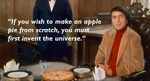

# DL-from-scratch



*"If you wish to make an apple pie from scratch, you must first invent the universe."* - Carl Sagan

---

## Overview

Building deep learning architectures from the ground up with minimal dependencies. This project implements neural networks using only PyTorch for tensor operations and automatic differentiation - all the core architectures (forward/backward passes, layers, optimizers) are implemented manually.

## Project Structure

```
DL-from-scratch/
├── src/
│   ├── MLP/          # Multi-Layer Perceptron with custom backprop
│   ├── CNN/          # Convolutional Neural Network from scratch
│   ├── RNN/          # Recurrent Neural Networks (Vanilla, LSTM, GRU)
│   └── Transformers/ # Full Transformer (encoder-decoder, multi-head attention)
└── assets/           # Images and resources
```

## What's Implemented

### [MLP - Multi-Layer Perceptron](src/MLP/)
- **Custom Backpropagation**: Manual gradient computation for Dense layers
- **Layers**: Dense (fully connected), ReLU activation
- **Loss Functions**: MSE, Cross-Entropy (with log-sum-exp stability)
- **Examples**: 
  - Classification (4-cluster problem)
  - Regression tasks
- **Initialization**: Kaiming/He initialization for better convergence

### [CNN - Convolutional Neural Network](src/CNN/)
- **Loop-based Convolution**: Custom correlation operations (educational, not optimized)
- **Layers**: Conv2D, MaxPool2D, AvgPool2D, Flatten
- **Examples**: 
  - MNIST digit classification
- **Note**: Uses CPU due to loop-based implementation (slow but clear)

### [RNN - Recurrent Neural Networks](src/RNN/)
- **Three Architectures**: 
  - Vanilla RNN (with tanh activation)
  - LSTM (Long Short-Term Memory)
  - GRU (Gated Recurrent Unit)
- **Examples**: 
  - Shakespeare text generation
  - Architecture benchmarking
- **Features**: Character-level language modeling with one-hot encoding

### [Transformers - Sequence-to-Sequence](src/Transformers/)
- **Full Encoder-Decoder Transformer** from "Attention Is All You Need"
- **Components**: Scaled dot-product attention, multi-head attention, positional encoding, FFN, Add & Norm
- **Training**: Teacher forcing, masked cross-entropy loss, gradient clipping
- **Inference**: Autoregressive decoding with KV cache
- **Example**: English → French character-level translation

## Requirements

```bash
pip install torch matplotlib torchvision
```

## Quick Start

Each module has its own detailed README with mathematical formulas and usage examples:

- **[MLP Documentation](src/MLP/README.md)** - Backpropagation math, layer implementations
- **[CNN Documentation](src/CNN/README.md)** - Convolution operations, pooling layers
- **[RNN Documentation](src/RNN/README.md)** - RNN variants, LSTM/GRU architectures
- **[Transformer Documentation](src/Transformers/README.md)** - Attention mechanism, encoder-decoder architecture

### Example: Training an MLP

```python
from MLP import MLP, Dense, ReLU, CrossEntropyLoss
from engine import Engine, GradientDescent, DataLoader

# Define architecture
layers = [
    Dense(2, 32),
    ReLU(),
    Dense(32, 4)  # 4 output classes
]
model = MLP(layers)

# Setup training
loss = CrossEntropyLoss()
optimizer = GradientDescent(model, learning_rate=0.05)
dataloader = DataLoader(X, y, batch_size=32)
engine = Engine(model, loss, optimizer)

# Train
history = engine.fit(dataloader, epochs=50)
```

## Learning Objectives

This project helps you understand:
- How backpropagation actually works (manual gradient computation for MLP)
- The mechanics of convolution operations
- How RNNs maintain state across time steps
- Why LSTM/GRU solve vanishing gradient problems
- Proper weight initialization (Kaiming/He)
- Numerical stability tricks (log-sum-exp for softmax in MLP)
- How self-attention replaces recurrence (Transformers)
- Encoder-decoder architectures for sequence-to-sequence tasks

**Dive into each module's README for detailed mathematical formulas and implementation notes!**
