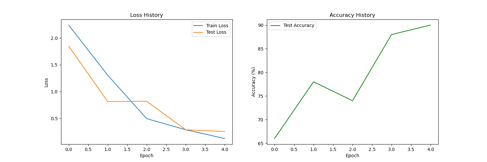
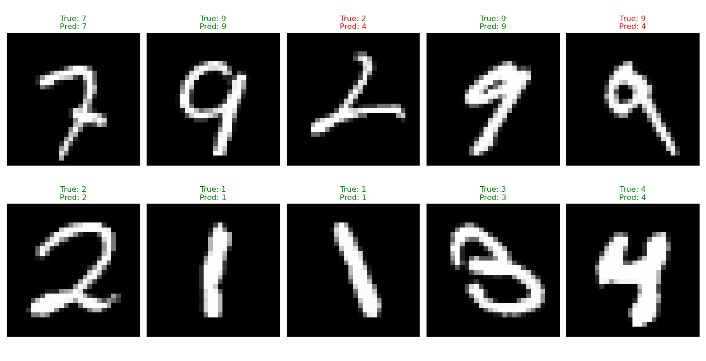

# CNN - Convolutional Neural Network

Custom implementation of CNNs using **loop-based convolution operations**. This implementation prioritizes clarity and educational value over performance.

## Why Loop-Based?

This implementation uses explicit Python loops to perform convolutions, making the operations transparent and easy to understand. While significantly slower than optimized implementations (cuDNN, im2col, etc.), it's perfect for learning exactly what's happening under the hood.

**Trade-off**: Slow but crystal clear!

## Architecture Components

### 1. Conv2D - Convolutional Layer

Applies 2D convolution (technically cross-correlation) to input feature maps.

**Operation:**

For a single input channel and single filter:

$$(X \star K)[i, j] = \sum_{m=0}^{h-1} \sum_{n=0}^{w-1} X[i \cdot s + m, j \cdot s + n] \cdot K[m, n]$$

Where:
- $X$ is the input feature map
- $K$ is the kernel/filter
- $s$ is the stride
- $h, w$ are kernel dimensions

**Multi-channel Input:**

For $C_{in}$ input channels:

$$Y[i, j] = \sum_{c=0}^{C_{in}-1} (X_c \star K_c)[i, j]$$

**Multi-channel Output:**

For $C_{out}$ output filters:

$$Y^{(k)} = \sum_{c=0}^{C_{in}-1} (X_c \star K^{(k)}_c) + b_k$$

Where $k \in \{0, \ldots, C_{out}-1\}$

**Output Size:**

$$H_{out} = \left\lfloor \frac{H_{in} + 2p - h}{s} \right\rfloor + 1$$

$$W_{out} = \left\lfloor \frac{W_{in} + 2p - w}{s} \right\rfloor + 1$$

Where:
- $H_{in}, W_{in}$ are input dimensions
- $p$ is padding
- $h, w$ are kernel dimensions
- $s$ is stride

**Initialization:**

Kaiming initialization for CNNs:

$$\text{fan}_{in} = C_{in} \times h \times w$$

$$W \sim \mathcal{N}\left(0, \sqrt{\frac{2}{\text{fan}_{in}}}\right)$$

**Core Implementation** (`CNN.py:6-53`):

The key operation is the nested loop cross-correlation:

```python
def corr2d(self, X, K):
    """Single-channel 2D cross-correlation"""
    h, w = K.shape
    out_h = (X.shape[0] - h) // self.stride + 1
    out_w = (X.shape[1] - w) // self.stride + 1
    Y = torch.zeros(out_h, out_w)
    
    for i in range(out_h):
        for j in range(out_w):
            i_step = i * self.stride
            j_step = j * self.stride
            # Element-wise multiply and sum
            Y[i, j] = (X[i_step:i_step+h, j_step:j_step+w] * K).sum()
    return Y
```

The layer extends this to handle multiple input/output channels with Kaiming initialization.

### 2. Pool2D - Pooling Layer

Reduces spatial dimensions using max or average pooling.

**Max Pooling:**

$$Y[i, j] = \max_{m,n \in \text{window}} X[i \cdot s + m, j \cdot s + n]$$

**Average Pooling:**

$$Y[i, j] = \frac{1}{h \times w} \sum_{m,n \in \text{window}} X[i \cdot s + m, j \cdot s + n]$$

**Output Size:**

$$H_{out} = \left\lfloor \frac{H_{in} - h}{s} \right\rfloor + 1$$

$$W_{out} = \left\lfloor \frac{W_{in} - w}{s} \right\rfloor + 1$$

**Core Operation** (`CNN.py:56-82`):

```python
def forward(self, x):
    B, C, H, W = x.shape
    p_h, p_w = self.pool_size
    
    out_h = (H - p_h) // self.stride + 1
    out_w = (W - p_w) // self.stride + 1
    
    output = torch.zeros(B, C, out_h, out_w)
    
    for b in range(B):
        for c in range(C):
            for i in range(out_h):
                for j in range(out_w):
                    window = x[b, c, h_start:h_start+p_h, w_start:w_start+p_w]
                    output[b, c, i, j] = window.max()  # or window.mean()
    return output
```

### 3. Flatten Layer

Reshapes 4D tensors (B, C, H, W) to 2D (B, C×H×W) for fully connected layers (`CNN.py:84-86`).

### 4. Padding

Zero-padding to preserve spatial dimensions. Adds $p$ zeros around the border of each feature map.

## Example Architecture: MNIST Classification

File: `mnist_classification.py`

### Network Architecture

```python
class MyCNN(nn.Module):
    def __init__(self):
        super().__init__()
        self.net = nn.Sequential(
            Conv2D(1, 4, kernel_size=(5, 5), padding=2),  # 28×28×1 → 28×28×4
            ReLU(),
            Pool2D(pool_size=(2, 2), stride=2),            # 28×28×4 → 14×14×4
            
            Conv2D(4, 8, kernel_size=(5, 5)),              # 14×14×4 → 10×10×8
            ReLU(),
            Pool2D(pool_size=(2, 2), stride=2),            # 10×10×8 → 5×5×8
            
            Flatten(),                                      # 5×5×8 → 200
            nn.Linear(8 * 5 * 5, 10)                       # 200 → 10 classes
        )
```

### Dimension Flow

```
Input:  28 × 28 × 1    (MNIST image)
  ↓
Conv1:  28 × 28 × 4    (5×5 kernel, padding=2)
  ↓
Pool1:  14 × 14 × 4    (2×2 max pool)
  ↓
Conv2:  10 × 10 × 8    (5×5 kernel, no padding)
  ↓
Pool2:   5 × 5 × 8     (2×2 max pool)
  ↓
Flatten: 200           (8 × 5 × 5)
  ↓
Linear:  10            (output classes)
```

### Usage

```python
from CNN import Conv2D, Pool2D, Flatten, ReLU
from engine import Engine, DataLoader

# Build model
model = MyCNN().to(device)

# Setup training
loss_fn = nn.CrossEntropyLoss()
optimizer = optim.Adam(model.parameters(), lr=0.01)
engine = Engine(model, loss_fn, optimizer, device=device)

# Train (small subset for speed)
engine.fit(train_loader, test_loader, epochs=5)
engine.plot()
```

### Training Results

The model achieves ~90% accuracy on MNIST test set after just 5 epochs:



*Loss decreases steadily while test accuracy improves to ~90%*

### Model Predictions



*Green = correct predictions, Red = incorrect. The model successfully classifies most digits despite the loop-based implementation.*

## Key Learning Points

1. **Convolution is Cross-Correlation**: Standard "convolution" in CNNs doesn't flip the kernel
2. **Receptive Field**: Each output pixel depends on a local region of input
3. **Parameter Sharing**: Same kernel applied to all spatial locations
4. **Translation Invariance**: Features detected regardless of position
5. **Spatial Hierarchy**: Pooling reduces dimensions, increases receptive field
6. **Channel Mixing**: Multi-channel convolution combines information across channels

## Performance Notes

### Why CPU?

This implementation uses **CPU** by default because:

1. **Loop-based operations** have significant overhead on GPU
2. GPU kernel launch overhead exceeds computation time for small operations
3. No im2col optimization or BLAS acceleration
4. Educational clarity > performance

### Speed Comparison

| Implementation | MNIST Epoch Time |
|---------------|------------------|
| This (CPU)    | ~30-60 seconds   |
| cuDNN (GPU)   | ~1-2 seconds     |

**Speed ratio**: ~30-50× slower

### Why So Slow?

1. **Nested loops**: 6-7 nested loops for convolution (batch, channels, output_h, output_w, kernel_h, kernel_w)
2. **No vectorization**: Element-by-element operations
3. **No im2col**: Modern CNNs reshape convolutions into matrix multiplies
4. **Python overhead**: Loops in Python (not compiled C++)

### What Real CNNs Do

Production implementations use:
- **im2col/col2im**: Convert convolution to GEMM (matrix multiply)
- **FFT-based convolution**: For large kernels
- **Winograd algorithm**: Fewer multiplications
- **CUDA kernels**: Parallelized GPU code
- **cuDNN**: Highly optimized NVIDIA library

## Mathematical Insight: Why Convolution?

**Traditional Dense Layer** for 28×28 image:
- Input: 784 neurons
- Hidden: 784 neurons
- Parameters: $784 \times 784 = 614,656$

**Convolutional Layer** with 5×5 kernel, 32 filters:
- Parameters: $5 \times 5 \times 32 = 800$ (+ 32 biases)
- **768× fewer parameters!**

**Local Connectivity**: Each output neuron connects to a $5 \times 5 = 25$ local region (vs. all 784)

**Parameter Sharing**: Same kernel applied everywhere (vs. unique weights per location)

## Files

- `CNN.py` - Core CNN layers (Conv2D, Pool2D, Flatten, ReLU)
- `engine.py` - Training utilities and visualization
- `mnist_classification.py` - MNIST digit classification example
- `main.ipynb` - Jupyter notebook experiments

---

**Remember**: This is for **learning**, not production. Use PyTorch's `nn.Conv2d` for real applications!
