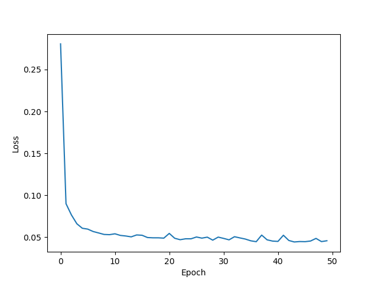
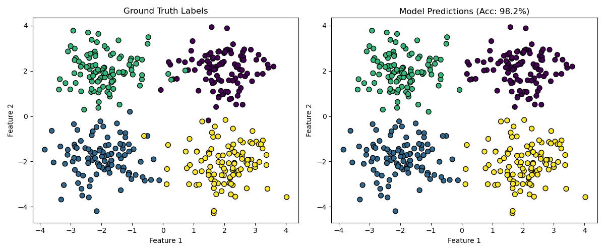
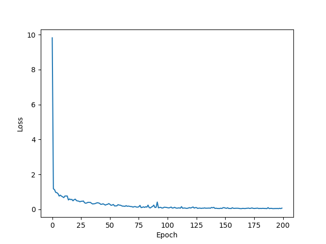

# MLP - Multi-Layer Perceptron

Custom implementation of multi-layer perceptrons with **manual backpropagation**. No automatic differentiation used - all gradients computed explicitly.

## Architecture Components

### 1. Dense (Fully Connected) Layer

The core building block of MLPs.

**Forward Pass:**

$$y = xW + b$$

Where:
- $x \in \mathbb{R}^{B \times d_{in}}$ (input)
- $W \in \mathbb{R}^{d_{in} \times d_{out}}$ (weights)
- $b \in \mathbb{R}^{1 \times d_{out}}$ (bias)
- $y \in \mathbb{R}^{B \times d_{out}}$ (output)

**Backward Pass:**

Given gradient from next layer $\frac{\partial L}{\partial y}$:

$$\frac{\partial L}{\partial W} = x^T \frac{\partial L}{\partial y}$$

$$\frac{\partial L}{\partial b} = \sum_{i=1}^{B} \frac{\partial L}{\partial y_i}$$

$$\frac{\partial L}{\partial x} = \frac{\partial L}{\partial y} W^T$$

**Initialization:**

Kaiming/He initialization for ReLU activation:

$$W \sim \mathcal{N}\left(0, \sqrt{\frac{2}{d_{in}}}\right)$$

**Core Implementation** (`MLP.py:11-38`):

```python
def forward(self, x):
    self.input = x  # Cache for backward pass
    return x.matmul(self.weight) + self.bias

def backward(self, grad_output):
    self.grad_weight = self.input.T.matmul(grad_output)
    self.grad_bias = grad_output.sum(axis=0, keepdims=True)
    grad_input = grad_output.matmul(self.weight.T)
    return grad_input
```

The gradients are computed manually using matrix calculus - no autograd!

### 2. ReLU Activation

**Forward Pass:**

$$\text{ReLU}(x) = \max(0, x)$$

**Backward Pass:**

$$\frac{\partial \text{ReLU}}{\partial x} = \begin{cases} 
1 & \text{if } x > 0 \\
0 & \text{otherwise}
\end{cases}$$

**Core Implementation** (`MLP.py:104-111`):

```python
def backward(self, grad_output):
    relu_grad = (self.input > 0).float()  # 1 if x > 0, else 0
    return grad_output * relu_grad
```

### 3. Loss Functions

#### Mean Squared Error (MSE)

Used for regression tasks.

$$L_{\text{MSE}} = \frac{1}{n} \sum_{i=1}^{n} (y_i - \hat{y}_i)^2$$

**Gradient:**

$$\frac{\partial L}{\partial \hat{y}} = \frac{2}{n}(\hat{y} - y)$$

#### Cross-Entropy Loss

Used for classification tasks.

$$L_{\text{CE}} = -\frac{1}{B} \sum_{i=1}^{B} \log\left(\frac{e^{z_{y_i}}}{\sum_{j} e^{z_j}}\right)$$

Where $z$ are logits and $y_i$ is the true class index.

**Numerical Stability (Log-Sum-Exp Trick):**

To prevent overflow, subtract the max logit:

$$\log\left(\sum_j e^{z_j}\right) = \max(z) + \log\left(\sum_j e^{z_j - \max(z)}\right)$$

**Gradient (Softmax + Cross-Entropy Combined):**

$$\frac{\partial L}{\partial z_j} = \frac{1}{B}(p_j - \mathbb{1}_{j=y_i})$$

Where $p_j = \frac{e^{z_j}}{\sum_k e^{z_k}}$ is the softmax probability.

**Key Implementation Detail** (`MLP.py:71-102`):

The log-sum-exp trick for numerical stability:

```python
# Shift logits to prevent overflow
max_logits = logits.max(dim=1, keepdim=True).values
shifted_logits = logits - max_logits

# Compute softmax and loss
log_sum_exp = torch.log(torch.exp(shifted_logits).sum(dim=1, keepdim=True))
loss = log_sum_exp - target_logits
```

The gradient is simply the softmax probabilities minus the one-hot target.

### 4. MLP Module

Combines multiple layers into a sequential network (`MLP.py:40-59`).

Forward pass loops through layers, backward pass reverses the order.

## Training Engine

The `engine.py` module provides training utilities:

- **GradientDescent**: Simple optimizer that updates parameters: $\theta \leftarrow \theta - \eta \nabla L$
- **DataLoader**: Handles batching and shuffling
- **Engine**: Training loop (forward → loss → backward → update)

## Examples

### Classification (4-Cluster Problem)

File: `classification.py`

**Task**: Classify data points into 4 clusters positioned at the corners of a square.

```python
# Build model: 2 inputs → 32 hidden → 32 hidden → 4 outputs
model = MLP([
    Dense(2, 32),
    ReLU(),
    Dense(32, 32),
    ReLU(),
    Dense(32, 4)
])

# Train with CrossEntropyLoss
loss = CrossEntropyLoss()
optimizer = GradientDescent(model, learning_rate=0.05)
engine.fit(dataloader, epochs=50)
```

**Training Results:**



*Loss decreases from 0.27 to ~0.05 in 50 epochs*



*Ground truth (left) vs predictions (right). The MLP achieves 98.2% accuracy on the 4-cluster problem!*

### Regression

File: `regression.py`

**Task**: Learn a non-linear function (e.g., parabola) from noisy data.

```python
# Build model: 1 input → 32 hidden → 1 output
model = MLP([
    Dense(1, 32),
    ReLU(),
    Dense(32, 1)
])

# Train with MSE loss
loss = MSE()
optimizer = GradientDescent(model, learning_rate=0.01)
engine.fit(dataloader, epochs=200)
```

**Training Results:**



*MSE loss drops from ~10 to near 0 over 200 epochs*


*The MLP (red line) perfectly fits the parabolic pattern in the noisy data (blue points)*

## Key Learning Points

1. **Manual Gradient Computation**: Every gradient is computed explicitly using the chain rule
2. **Numerical Stability**: Log-sum-exp trick prevents overflow in softmax
3. **Proper Initialization**: Kaiming/He initialization prevents vanishing/exploding gradients
4. **Backpropagation Flow**: Gradients flow backward through layers in reverse order
5. **Parameter Updates**: Simple gradient descent: $\theta \leftarrow \theta - \eta \nabla L$

## Files

- `MLP.py` - Core layer implementations (Dense, ReLU, MLP, Loss functions)
- `engine.py` - Training utilities (Engine, Optimizer, DataLoader)
- `classification.py` - 4-cluster classification example
- `regression.py` - Simple regression example
- `main.ipynb` - Jupyter notebook with experiments

## Usage

```python
from MLP import MLP, Dense, ReLU, CrossEntropyLoss
from engine import Engine, GradientDescent, DataLoader

# Define architecture
model = MLP([
    Dense(input_dim, hidden_dim),
    ReLU(),
    Dense(hidden_dim, output_dim)
])

# Setup training
loss = CrossEntropyLoss()  # or MSE() for regression
optimizer = GradientDescent(model, learning_rate=0.01)
dataloader = DataLoader(X, y, batch_size=32)
engine = Engine(model, loss, optimizer)

# Train
engine.fit(dataloader, epochs=100)
engine.plot()  # Visualize training loss
```

---

**No PyTorch autograd used - all backpropagation is manual!**
