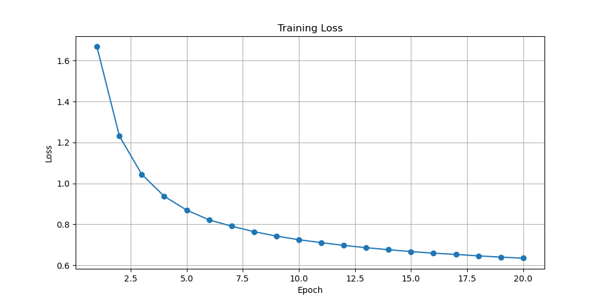

# Transformer - Sequence-to-Sequence Model

Custom implementation of the **Transformer** architecture from ["Attention Is All You Need"](https://arxiv.org/abs/1706.03762). Built from scratch using PyTorch tensor operations — no `nn.Transformer` used.


## Why Transformers?

RNNs process sequences **one token at a time**, which limits parallelism and makes learning long-range dependencies hard. Transformers replace recurrence entirely with **self-attention**, enabling:

- Full parallelism during training
- Direct modeling of long-range dependencies
- Scalability to very large datasets and models
- State-of-the-art performance on sequence-to-sequence tasks (translation, summarization, etc.)

## Architecture Components

### 1. Scaled Dot-Product Attention (`DotProductAttention`)

The core building block. Given queries $Q$, keys $K$, and values $V$:

$$\text{Attention}(Q, K, V) = \text{softmax}\!\left(\frac{QK^T}{\sqrt{d_k}}\right) V$$

Where:
- $Q \in \mathbb{R}^{n_q \times d_k}$: queries
- $K \in \mathbb{R}^{n_{kv} \times d_k}$: keys
- $V \in \mathbb{R}^{n_{kv} \times d_v}$: values
- $\sqrt{d_k}$: scaling factor to prevent dot products from growing too large

**Masked softmax** (`MaskedSoftmax`) replaces padding positions with $-10^6$ before the softmax, so padding tokens contribute zero weight.

**Core Implementation** (`transformers.py:33-43`):

```python
def forward(self, Q, K, V, valid_lens=None):
    d = Q.shape[-1]
    scores = torch.bmm(Q, K.transpose(1, 2)) / math.sqrt(d)
    self.attention_weights = self.masked_softmax(scores, valid_lens)
    return torch.bmm(self.dropout(self.attention_weights), V)
```

---

### 2. Multi-Head Attention (`MultiHeadAttention`)

Runs $h$ attention heads in **parallel**, each attending to different representation subspaces:

$$\text{MultiHead}(Q, K, V) = \text{Concat}(\text{head}_1, \ldots, \text{head}_h) W^O$$

$$\text{head}_i = \text{Attention}(Q W^Q_i,\ K W^K_i,\ V W^V_i)$$

All heads are computed at once by reshaping tensors: `[batch, seq, d_model]` → `[batch × heads, seq, d_model/heads]`.

**Core Implementation** (`transformers.py:72-86`):

```python
def forward(self, Q, K, V, valid_lens):
    Q = self.transpose_qkv(self.W_q(Q))
    K = self.transpose_qkv(self.W_k(K))
    V = self.transpose_qkv(self.W_v(V))
    if valid_lens is not None:
        valid_lens = torch.repeat_interleave(valid_lens, self.num_heads, dim=0)
    output = self.attention(Q, K, V, valid_lens)
    output_concat = self.transpose_output(output)
    return self.W_o(output_concat)
```

---

### 3. Positional Encoding (`PositionalEncoding`)

Since attention has no notion of order, position information is injected via sinusoidal encodings:

$$PE_{(pos, 2i)} = \sin\!\left(\frac{pos}{10000^{2i/d}}\right)$$

$$PE_{(pos, 2i+1)} = \cos\!\left(\frac{pos}{10000^{2i/d}}\right)$$

The encodings are pre-computed in `__init__` (`transformers.py:88-101`) and simply added to the embeddings at forward time:

```python
pos   = torch.arange(max_len).reshape(-1, 1)          # (max_len, 1)
term  = torch.pow(10000, indices / num_hidden)         # (d/2,)
X     = pos / term                                     # (max_len, d/2)
self.P[:, :, 0::2] = torch.sin(X)                     # even dims
self.P[:, :, 1::2] = torch.cos(X)                     # odd dims
```

Each position gets a unique encoding, and relative positions are implicitly captured by the sinusoidal pattern.

---

### 4. Position-wise Feed-Forward Network (`PositionWiseFFN`)

Applied independently to each position after attention:

$$\text{FFN}(x) = \text{ReLU}(xW_1 + b_1)W_2 + b_2$$

A simple 2-layer MLP with a hidden expansion (typically $d_{ff} = 2 \times d_{model}$ or $4 \times$).

---

### 5. Add & Norm (`AddNorm`)

Each sub-layer (attention, FFN) is wrapped with a **residual connection** followed by **layer normalization**:

$$\text{output} = \text{LayerNorm}(X + \text{Sublayer}(X))$$

$$\text{LayerNorm}(x) = \gamma \cdot \frac{x - \mu}{\sqrt{\sigma^2 + \epsilon}} + \beta$$

This implementation follows the **Post-Norm** convention from the original paper. (Pre-Norm is more common today for stability.)

---

### 6. Encoder (`TransformerEncoder`)

Stacks $N$ identical encoder blocks. Each block applies:
1. Multi-head **self-attention** (with source padding mask)
2. Add & Norm
3. Position-wise FFN
4. Add & Norm

**Core Implementation** (`transformers.py:156-173`):

```python
def forward(self, X, valid_lens):
    X = self.pos_encoding(self.embedding(X)) * math.sqrt(self.num_hidden)
    for layer in self.layers:
        X = layer(X, valid_lens)
    return X
```

---

### 7. Decoder (`TransformerDecoder`)

Stacks $N$ identical decoder blocks. Each block has **three** sub-layers:

1. **Masked self-attention** — attends only to previous tokens (causal mask via `dec_valid_lens`)
2. **Cross-attention** — queries come from decoder, keys/values from encoder output
3. **Position-wise FFN**

A **KV cache** (`state[2]`) accumulates past key-value pairs during inference to avoid recomputation. See `transformers.py:186-204` for the full block structure.

The KV cache itself (`transformers.py:188-192`):

```python
# During inference, concatenate new token's K/V with all previous ones
if state[2][self.i] is None:
    key_values = X                                    # first step: no cache yet
else:
    key_values = torch.cat((state[2][self.i], X), dim=1)  # append to cache
state[2][self.i] = key_values                        # store updated cache
```

This means the self-attention at step $t$ attends over all tokens $1, \ldots, t$ without recomputing past representations.

---

## Example: English → French Translation

File: `eng2fr.py`

### Data Preparation

**Character-level tokenization** with special tokens:

| Token | Meaning |
|-------|---------|
| `<bos>` | Beginning of sequence |
| `<eos>` | End of sequence |
| `<pad>` | Padding to fixed length |
| `<unk>` | Unknown character |

The `fra.txt` dataset contains tab-separated `English\tFrench` sentence pairs.

### Teacher Forcing

During training, the decoder receives the **ground-truth** previous tokens as input (not its own predictions):

```
Encoder input:  <bos> H e   i s ... <eos>
Decoder input:  <bos> I l   e s t ...
Decoder target: I     l   e s t ... <eos>
```

This stabilizes training compared to feeding back predicted tokens.

### Training Configuration

```python
model = Transformer(
    vocab_size=len(char_to_idx),
    num_hidden=128,     # embedding/attention dimension
    num_heads=4,        # parallel attention heads
    ffn_num_hidden=256, # FFN hidden dimension
    num_layers=2,       # encoder/decoder stack depth
    dropout=0.1
)

# Adam optimizer with gradient clipping
optimizer = torch.optim.Adam(model.parameters(), lr=0.001)
torch.nn.utils.clip_grad_norm_(model.parameters(), 1.0)
```

Loss is **masked cross-entropy** — `<pad>` tokens are excluded from the loss computation.



*Training loss curve for the English → French translation model.*

### Autoregressive Inference

At test time, the decoder generates tokens one by one:

1. Encode the source sentence → encoder context
2. Feed `<bos>` as the first decoder input
3. Take `argmax` of the output logits → predicted token
4. Feed predicted token back as next input
5. Repeat until `<eos>` or `max_len` is reached

## Key Learning Points

### 1. Self-Attention vs. Recurrence

```
RNN:         x_1 → h_1 → h_2 → h_3 → ... → h_T   (sequential)
Transformer: all tokens attend to all others in parallel
```

### 2. Attention Complexity

Attention is $O(n^2 \cdot d)$ in sequence length — quadratic! Efficient for moderate lengths, but costly for very long sequences.

### 3. Causal Masking

The decoder uses a triangular mask so position $t$ can only see positions $1, \ldots, t$.
This is implemented by setting `dec_valid_lens[i, t] = t`, which tells `MaskedSoftmax` to zero out all future positions — effectively masking the upper triangle of the attention matrix.

### 4. KV Cache

During inference, past key-value pairs are cached in `state[2]` so each new token requires only one forward pass through the attention layers (not re-processing all previous tokens).

### 5. Embeddings Scaling

Embeddings are scaled by $\sqrt{d_{model}}$ before adding positional encodings, so the positional signal has comparable magnitude to the learned embeddings.

## Files

- `transformers.py` - Full Transformer architecture (attention, encoder, decoder)
- `engine.py` - Tokenizer, DataLoader, `Seq2SeqEngine` (training + inference)
- `eng2fr.py` - English-to-French translation training script
- `fra.txt` - English-French sentence pair dataset
- `main.ipynb` - Jupyter notebook experiments

## Usage

```python
from transformers import Transformer
from engine import Tokenizer, TransformerDataLoader, DataManager, Seq2SeqEngine

# Load & tokenize data
src_texts, tgt_texts = DataManager.load_data("fra.txt")
tokenizer = Tokenizer(" ".join(src_texts + tgt_texts), use_path=False)
char_to_idx, idx_to_char = tokenizer.build_vocab()

# Build model
model = Transformer(
    vocab_size=len(char_to_idx),
    num_hidden=128,
    num_heads=4,
    ffn_num_hidden=256,
    num_layers=2,
    dropout=0.1
)

# Train
loader = TransformerDataLoader(src_texts, tgt_texts, char_to_idx, max_len=30, batch_size=256)
engine = Seq2SeqEngine(model, char_to_idx, device)
loss_history = engine.train(loader, lr=0.001, num_epochs=20, char_to_idx=char_to_idx)

# Translate
translation = engine.predict("He is sleeping", char_to_idx, idx_to_char, max_len=20)
```

## Dataset Credit

The `fra.txt` file is sourced from the **[Tatoeba Project](https://tatoeba.org)**, a free collaborative online database of example sentences.

> **License**: [CC-BY 2.0 (France)](https://creativecommons.org/licenses/by/2.0/fr/)
> Each sentence pair includes attribution to the original contributors on tatoeba.org.
